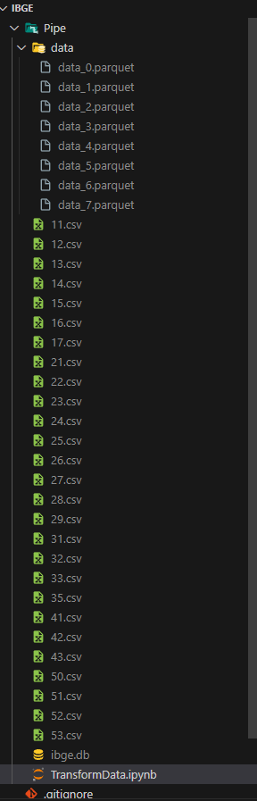

# LPED-Disciplina-03-Trabalho

## Descrição do Projeto
Este projeto tem como objetivo realizar a leitura e compressão dos dados dos endereços, que estarão após o processo, disponíveis no formato .parquet. Os dados serão persistidos localmente utilizando Duck DB como base de dados. A fonte dos dados é o Instituto Brasileiro de Geografia e Estatística (IBGE).

Os dados locais estão atualmente armazenados em formato .CSV

Este trabalho foi desenvolvido por W. Carvalho em 2024.

## Fonte de Dados
- **Origem**: IBGE
- **Formato, Compressão**: .parquet
- **Armazenamento Local para Leitura**: CSV

### Data/ Armazenamento após processamento e compressão.
### Pipe/ Arquivos Locais .csvs

### Referencia Local

###### Resultados obtidos  em armazenamento, após compressão:

| Armazenamento  | Tipo Dado   |
| ------------ | ------------ |
| 3,9 GB   |   CSV |
|  1,4 GB   |   .Parquet |

``Documentação utilizada no projeto``

[https://duckdb.org/docs/guides/index](https://duckdb.org/docs/guides/index)
[https://duckdb.org/docs/data/partitioning/partitioned_writes](https://duckdb.org/docs/data/partitioning/partitioned_writes)
[https://duckdb.org/docs/guides/import/csv_import](https://duckdb.org/docs/guides/import/csv_import)

